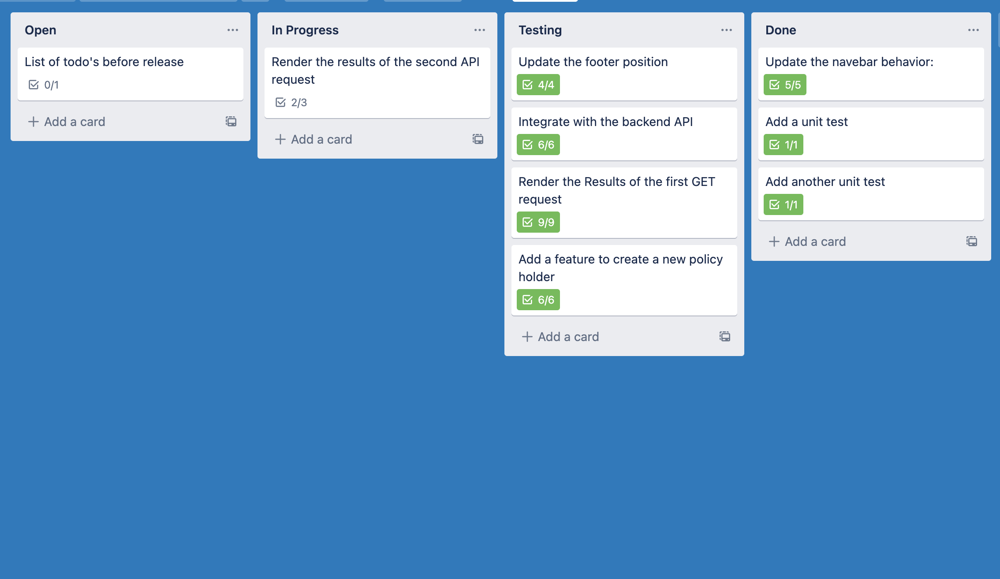

# Sure Frontend Technical Challenge

## Demo
 [Link to demo of development branch](https://surefechallenge.surge.sh/)

## Goal
The FE technical challenge consisted of 9 tasks to attempt to complete within a pre-built app given a 3 day window. The goal was add the project to a new repo, to attempt to complete those tasks and file a Pull Request capturing the updates you make to complete the assignment.

## Built with: 
  * React
  * Typescript
  * JavaScript
  * styled-components, mui
  * axios
  * cypress, jest, enzyme

## Project Planning
I appproached this challenge by creating a trello board to keep track of assignments and met requirements. I also wanted to be sure to go back and test that all requirements were met. Below is a screen capture about half way through. 

    </img>

## Future Additions and Todos
 * Make less assumptions and ask more questions about why and who: if we were going to ship this to production, there would need to be a whole conversation about who this is for and why they need it. Is there a design approved? Do we need to add an form for users to add policy holders? Is there any scope we need to cut for time puporses? Are there any barriers allowing the code to be acccessible to those users both with and/or without disabilities so we are creating an inclusive space on our platform?
 * Make the code cleaner: refactoring and organizing components. Make use of more styled components instead of passing styles inline. Find out how the team likes to format and organize code so I can match those practices (and also offer some solutions).
 * Make the UI prettier: I was focused more on hitting the functionality in each challenge vs. making it look beautiful, which perhaps was a bad assumption on my part. Add a loading spinner for when the user is waiting on data reponse.
 * Add more jest tests - test happy paths, edge cases. There were not any inputs from a form on this, but if we did, having some sort of validation schema would be nice.
 * More functional testing: check performance on different browsers, slower browsers, different machines, different media views (mobile vs tablet), screen readers.'
 * Thorough code review performed by both myself and 2 peers. Is this the expected file structure? Are there areas where code could perform better with a refactor? Remove leftover comments - comments can lie, the code does not.

## Getting Started
* Current changes for the challenges are displayed in branch `development_branch`
* `yarn install` to install dependencies.
* `yarn start` to run the app locally.
* Once the development server is running, you can open [http://localhost:3000](http://localhost:3000) to view it in the browser.
* You can view the instructions in the app by clicking the "View challenges" button.
___
## More info

This project was bootstrapped with [Create React App](https://github.com/facebook/create-react-app).

In the project directory, you can run:

### `yarn start`

Runs the app in the development mode.\
Open [http://localhost:3000](http://localhost:3000) to view it in the browser.

The page will reload if you make edits.\
You will also see any lint errors in the console.

### `yarn test`

Launches the test runner in the interactive watch mode.\
See the section about [running tests](https://facebook.github.io/create-react-app/docs/running-tests) for more information.

### `yarn build`

Builds the app for production to the `build` folder.\
It correctly bundles React in production mode and optimizes the build for the best performance.

The build is minified and the filenames include the hashes.\
Your app is ready to be deployed!

See the section about [deployment](https://facebook.github.io/create-react-app/docs/deployment) for more information.

Builds the app for production to the `build` folder.\
It correctly bundles React in production mode and optimizes the build for the best performance.

The build is minified and the filenames include the hashes.\
Your app is ready to be deployed!

See the section about [deployment](https://facebook.github.io/create-react-app/docs/deployment) for more information.

## Learn More

You can learn more in the [Create React App documentation](https://facebook.github.io/create-react-app/docs/getting-started).

To learn React, check out the [React documentation](https://reactjs.org/).
